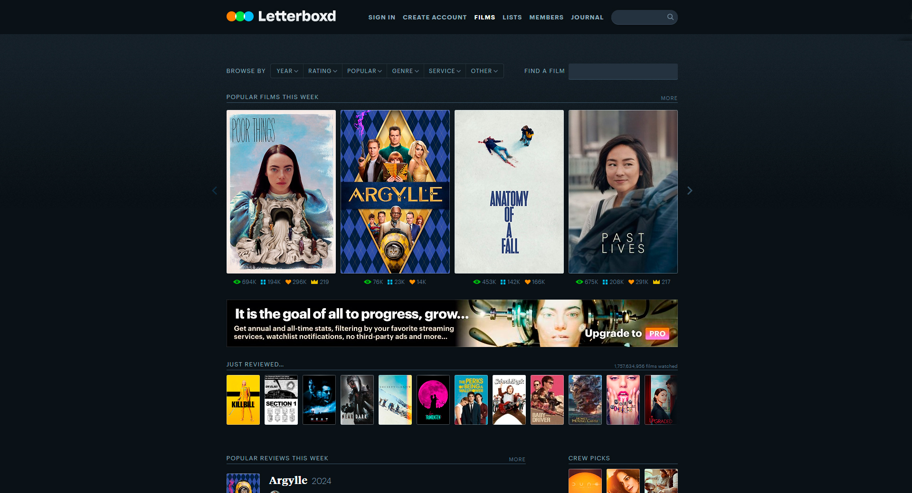
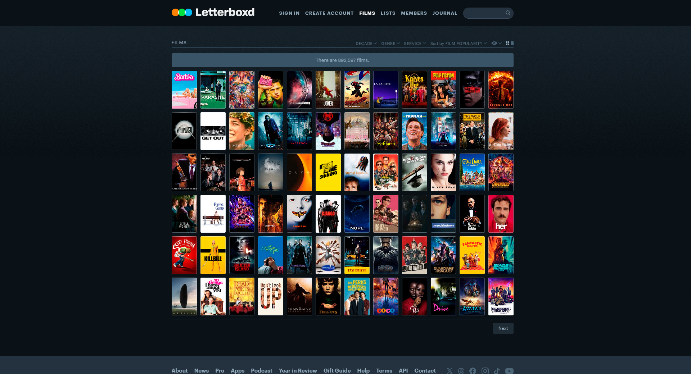
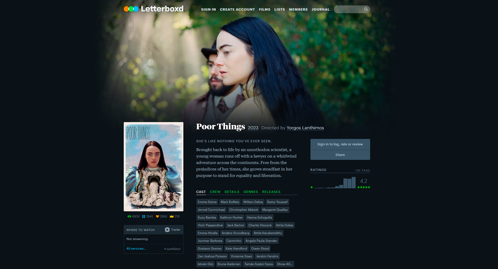

# Описание данных

Данные собраны и систематизированы с помощью программы с сайта 
[letterboxd.com](https://www.letterboxd.com) (см. [сбор данных](parsing.md)).

## О сайте letterboxd.com:

"**Letterboxd** — это глобальная социальная сеть для массового обсуждения 
и открытия фильмов. Используйте его как дневник, чтобы записывать 
и делиться своим мнением о фильмах во время их просмотра или просто 
для отслеживания фильмов, которые вы смотрели в прошлом. 
Продемонстрируйте свои фавориты на странице своего профиля. 
Оценивайте, просматривайте и отмечайте фильмы по мере их добавления. 
Найдите своих друзей и подпишитесь на них, чтобы узнать, что им нравится. 
Ведите список фильмов, которые вы хотели бы посмотреть, 
и создавайте списки/коллекции по любой теме. 
Нас описывают как "что-то вроде GoodReads для фильмов"." - с сайта 
**[letterboxd.com](https://www.letterboxd.com)**.

"Википедия определяет letterboxing как практику переноса фильма, 
снятого с широкоэкранным соотношением сторон, в видеоформаты стандартной ширины 
с сохранением исходного соотношения сторон. Обычно это достигается 
путем добавления подложек (или "черных полос") над и под областью изображения. 
Letterboxd назван в честь нашей любви к широкоэкранному формату." - с сайта 
**[letterboxd.com](https://www.letterboxd.com)**.

Все метаданные, связанные с фильмами, используемые в Letterboxd, 
включая имена актеров, режиссеров и студий, краткие описания, даты выпуска, 
трейлеры и постеры, предоставляются 
[The Movie Database](http://themoviedb.org) (TMDb).

## Описание полей

Данные содержат следующие поля:
1. **movies.csv** - основная информация о фильмах:
    - **id** - идентификатор фильма (первичный ключ);
    - **name** - название фильма;
    - **date** - год выхода фильма;
    - **tagline** - слоган фильма;
    - **description** - описание фильма;
    - **minute** - продолжительность фильма (в минутах);
    - **rating** - средний рейтинг фильма.
2. **actors.csv** - актеры, принимавшие участие в съемках фильмов:
    - **id** - идентификатор фильма (внешний ключ);
    - **name** - имя;
    - **role** - роль.
3. **crew.csv** - съемочная группа:
    - **id** - идентификатор фильма (внешний ключ);
    - **role** - роль в съемочной группе (режиссер, сценарист и тд.);
    - **name** - имя. 
4. **languages.csv** - на каких языках были сняты фильмы:
    - **id** - идентификатор фильма (внешний ключ);
    - **type** - тип (первичный, разговорный и тд.)
    - **language** - язык фильма.
5. **studios.csv** - киностудии:
    - **id** - идентификатор фильма (внешний ключ);
    - **studio** - киностудия.
6. **countries.csv** - страны:
    - **id** - идентификатор фильма (внешний ключ);
    - **country** - страна.
7. **genres.csv** - жанры фильмов:
    - **id** - идентификатор фильма (внешний ключ);
    - **genre** - жанр фильма.
8. **themes.csv** - темы в фильмах:
    - **id** - идентификатор фильма (внешний ключ);
    - **theme** - тема фильма.
9. **releases.csv** - релизы фильмов:
    - **id** - идентификатор фильма (внешний ключ);
    - **country** - страна релиза;
    - **date** - дата релиза фильма;
    - **type** - тип релиза (театральный, телевизионный и тд.) фильма.
    - **rating** - возрастной рейтинг фильма.
10. **posters.csv** - постеры фильмов:
    - **id** - идентификатор фильма (внешний ключ);
    - **country** - url-адрес.
11. **posters** - постеры фильмов.

Примечание:
1. **tagline** (слоган фильма) присутствует только у относительно 
современных фильмов.
2. **rating** (средний рейтинг фильма) отсутствует у большинства фильмов, 
так как вероятнее всего для его расчета нет достаточного количества оценок.
3. Если значение **type** (тип языка фильма) - Language, 
значит язык является как первичным, так и разговорным 
(Primary language и Spoken language).
4. У некоторых фильмов отсутствует постер (по естественным причинам).

[К описанию проекта](../README.md)